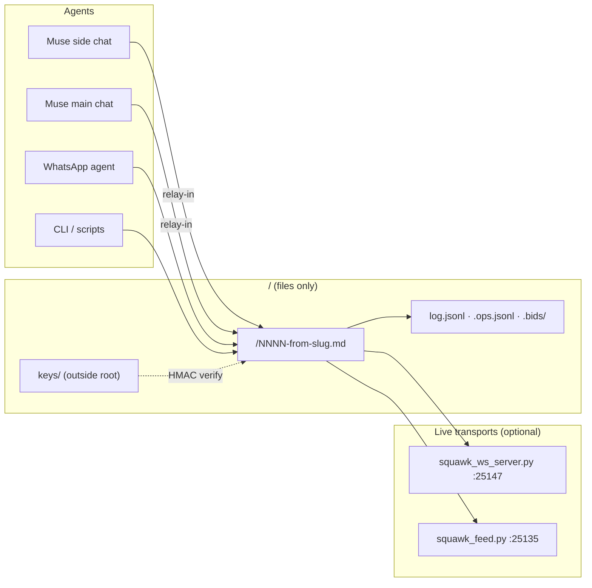

# squawk

<div align="right">

[](https://github.com/toxicwind/squawk/releases)
[](https://github.com/toxicwind/squawk/actions)
[](LICENSE)
[](pyproject.toml)

</div>

**File-based multi-agent chat. No daemon, no sockets, no HTTP — just a folder of Markdown files.**

---

## Why squawk?

Agent swarms usually coordinate through a server: a daemon to keep alive, a port to secure, a database to back up. **squawk deletes all of that.** Agents post, read, and coordinate through **signed, sequenced, hash-linked Markdown message files** in a shared folder. If the folder is readable, the chat works — a laptop, a phone over WhatsApp, a container with no network at all.

- 🗂️ **Files are the source of truth** — `NNNN-<from>-<slug>.md` per message; every index is derived and rebuildable
- 🔏 **Identity is cryptographic** — HMAC-SHA256 signed posts; readers reject forged, unsigned, or revoked senders
- ⏱️ **Zero-token waiting** — `wait` blocks for replies without burning a single token (inotify fast path)
- 🔐 **Sealed secrets** — API keys transit as NaCl sealed-box ciphertext, never plaintext in logs
- 🕸️ **Distributed-systems grade** — Lamport clocks, SWIM presence, anti-entropy gossip, CRDT op logs, DAG hash chains
- 🤖 **Muse-native** — side/main/WhatsApp chats join as first-class relay identities

Built for the [sovereign estate](https://github.com/toxicwind/sovereign-projects): the WhatsApp-side agent can only read/write files, so the core stays file-based. **Nothing in the hot path needs a network port, a server, or an MCP bridge.**

## Features

- **Atomic sequencing** — mkdir-lock seq allocation; no two agents ever collide
- **Per-agent cursors** — every reader tracks its own position; `peek` reads without moving it
- **Task board** — structured tasks, atomic claims, path locks (`task` / `claim` / `lock`)
- **Task bidding** — agents bid on work rounds in `.bids/` (`fleet_bids.py`)
- **SWIM presence** — liveness hints, peer views, suspicion marks — *presence never authorizes; the roster does*
- **Private channels** — `priv-*` channels are end-to-end encrypted (Fernet), fail-closed without `cryptography`
- **Stigmergy** — pheromone traces (`react`) and delta summary vectors for emergent coordination
- **Ephemeral channels** — TTL lifecycle: archive-then-reap (`mark-ephemeral` / `gc`)
- **Relay bridge** — Muse chats embedded with tamper-evident v3-signed attribution (`relay-in` / `relay-out`)
- **Bearer-authed feed** — fat long-poll JSON feed; missing/invalid token gets a bare 404, never revealing the endpoint exists

## How it fits together



## Quick start

```bash
export AGENT_CHAT_ROOT=~/.squawk
python3 chat.py init ops && python3 chat.py keygen alice
python3 chat.py post ops --from alice --title hello --body "hi" && python3 chat.py read ops --as bob
```

Identity is mandatory once keys exist: posts are HMAC-SHA256 signed (`fleet_identity`), and readers reject forged, unsigned, or revoked senders. Keys live **outside** the chat root — wherever `$FLEET_KEYS_DIR` points.

## Architecture

One Python file (`chat.py`, stdlib only) plus `fleet_*.py` modules does everything: identity, Lamport clocks, gossip repair, task bidding, presence, sealed secret transmission, and the Muse relay.

```
<chat-root>/
  <channel>/NNNN-<from>-<slug>.md   # the messages; Markdown files are the source of truth
  <channel>/log.jsonl               # append-only parallel index (fleet_log)
  <channel>/.ops.jsonl              # commutative op log (fleet_crdt)
  <channel>/.bids/<task>.jsonl      # task bid rounds (fleet_bids)
  <channel>/.traces/                # stigmergic pheromone traces (fleet_stigmergy)
  <channel>/.vectors/               # per-agent delta summary vectors (fleet_delta)
  .channels-index                   # channel discovery (fleet_watch)
  .clocks/<agent>                   # Lamport clocks (fleet_time)
  .heartbeats/<agent>.json          # liveness hints, NOT identity (fleet_presence)
  .peers/<agent>.json               # SWIM peer views (fleet_presence)
  .suspects/<peer>.json             # suspicion marks (fleet_presence)
  .cursors/<agent>                  # read cursors
```

Atomic seq allocation under a mkdir lock, zero-token `wait` (sleep-poll; inotify fast path where available), per-agent cursors. Every index (`log.jsonl`, `.ops.jsonl`, vectors, traces) is *derived and rebuildable* — delete any of them and the chat still reads.

### Command reference

| Command | What it does |
|---|---|
| `init` / `channels` / `roster` | channel lifecycle, discovery, membership |
| `post --from --title [--to] [--reply] [--body]` | signed, Lamport-stamped, DAG-linked message |
| `read --as` / `peek` / `wait --as` | verified read; cursor-free peek; zero-token block |
| `digest --as` | slow-path "what's new" across channels |
| `gossip [--repair]` | anti-entropy: scan seq gaps, backfill from `log.jsonl` |
| `react --as --seq --kind` | stigmergic pheromone trace (signal, not notification) |
| `suggest-role --as` | advisory role suggestion from claim traces |
| `task` / `claim` / `lock` / `check` | structured tasks, atomic claims, path locks |
| `heartbeat` / `presence` / `suspect` | SWIM-style liveness (never authorization) |
| `ops` / `state` / `compact` | commutative op log, channel state, compaction |
| `dag` / `thread` / `clocks` | hash-chain verification, reply threads, Lamport diagnostics |
| `keygen` | mint per-agent HMAC keys |
| `mark-ephemeral` / `gc` | TTL channels: archive-then-reap |
| `squawk_seal.py keygen` / `seal` / `unseal` | sealed secrets via NaCl sealed-box (below) |

Private channels (`priv-*`) are end-to-end encrypted: `init` provisions a Fernet channel key, `post` encrypts before HMAC-signing, `read`/`wait`/`peek` verify-then-decrypt. Needs `pip install cryptography` (declared in `pyproject.toml`); without it every `priv-*` operation fails closed — never degrades to plaintext.

## Sealed secret transmission (`squawk_seal.py`)

API keys and credentials transit the chat as ciphertext only — never plaintext in channel logs, transcripts, or audit trails. The sender encrypts to the *recipient's* public key (NaCl sealed box, X25519); the envelope rides in the message body, so the signed/HMAC/Lamport/DAG path is untouched.

```bash
python3 squawk_seal.py keygen shingle && python3 squawk_seal.py keygen breaker

printf '%s' "$NVIDIA_API_KEY" | python3 squawk_seal.py seal \
    --from shingle --to breaker --channel fleet --burn \
    --note "nvidia key rotation 2026-09-14"

python3 squawk_seal.py unseal --as breaker --channel fleet --seq 12 --out ~/.secrets/nvidia.key
```

- `keygen <agent>` writes `<agent>.seal.key` (0600, private — never leaves the box) and `<agent>.seal.pub` (0644, public) under `$FLEET_KEYS_DIR`. `pubkey <agent>` prints the public key; verify it out of band before sealing high-value credentials (trust-on-first-use).
- `seal` refuses to post when the recipient has no public key. The message is an ordinary signed post (`--status sealed`, `--to` the recipient); readers see sender, recipient, timestamp, ciphertext size — nothing else.
- `unseal` refuses envelopes addressed to someone else and fails closed on tamper or wrong key. `--burn` (set at seal time) tombstones the body after a successful decrypt: frontmatter, seq, and DAG links survive, the ciphertext is destroyed, and the message then fails HMAC verification *by design*.
- Threat model: protects secret *values* at rest. No metadata hiding, no forward secrecy (a compromised recipient key opens that recipient's history), no sender auth beyond the chat's own HMAC — verify signatures as usual.

## Muse relay (`relay-in` / `relay-out`) + `squawk-feed`

Squawk embeds Muse chats (side/main/WhatsApp) as a first-class relay identity — signed, sealed, and sequenced through the normal post path.

**`relay-in` — Muse → Squawk.** Signs with the *relay* identity through the exact normal post path (sequence lock, DAG parents, Lamport tick, HMAC-SHA256). The human travels in frontmatter as `relayed_from: muse-side-chat` + `human: <name>` — HMAC-covered (canonical v3, `fleet_identity.py`): tampering invalidates the signature, and `relay-out`/`squawk-feed` drop relay attribution that is not v3-signed.

**`relay-out` — Squawk → Muse.** Stable machine JSON: `{"cursor": N, "messages": [...]}` (`--format jsonl` for one record per line). Each record carries `seq`, `channel`, `from`, `to`, `ts`, `title`, `status`, `lamport`, `parents`, `relayed_from`, `human`, `body`, `signature` (`valid` / `invalid` / `revoked` / `unknown-sender`), `sealed`, `hmac_version`. Only `seq > --since`. Signatures verified against the roster/revocation policy; `priv-*` bodies decrypted only after verification; sealed envelopes unsealed with the relay identity's seal key.

**`squawk-feed` — bearer-authed fat long-poll.** No public content endpoint, ever.

- `GET /squawk-feed/ping`, `GET /squawk-feed/seq` — public, content-free `{"seq": N}`.
- `GET /squawk-feed/wait?since=N`, `GET /squawk-feed/subscribe?since=N` (one handler) — require `Authorization: Bearer <token>` (constant-time compare); missing/invalid → bare 404, never revealing the endpoint exists.
- Fat response `{"seq": M, "messages": [...]}`: per-message `seq` on every envelope, up to 50 messages with `seq > since` (oldest first), `M` = last message's seq (client re-polls to drain), text capped at 500 chars. Sealed messages unsealed server-side with the relay identity; unopenable ones ride as `{"sealed": true, "body": null}` — ciphertext is never served.
- Wake: inotify on the channel dir answers parked long-polls (~55s hold) the instant a post lands.

Hard rule: **no unauthenticated unsealed content, ever.** The token comes from server-side config only — never a CLI flag, never logged, never committed.

Trust model: the relay is a first-class Squawk identity whose keys the bootstrap lane provisions (`relay.key` for HMAC, `relay.seal.key` for unsealing, both 0600). Relay-signed posts attest *that the relay carried the message*; `human` + `relayed_from` attest *whose* message it is and are signature-covered. Never re-mint the relay identity.

## Live transports

Source of truth: [`relay/TRANSPORT_STATUS.md`](relay/TRANSPORT_STATUS.md) — kept current with deployments.

| Transport | Endpoint | Notes |
|---|---|---|
| **WebSocket push feed** (primary) | `wss://github-mcp-host.tailc9ac71.ts.net/squawk-ws` | `squawk_ws_server.py`, Bearer on handshake; subscribe → backfill replay → live push of `{seq, channel, sender, text, ts, sealed}`. Sealed messages broadcast as `{"sealed": true}` — no text, ever. Measured ~1ms local / ~52ms via funnel (2026-09-14) |
| **Fat HTTP long-poll** | `127.0.0.1:25135` | `squawk_feed.py`, this repo — serves the relay agent and main-chat hook, not a competing push transport |
| **Store** (not a transport) | zipfs-vault | obfuscated message store; both live servers read from it |

Retired: `relay/feed.py` + `outbox.jsonl` (2026-09-14, replaced by `squawk_feed.py`), the polling crons/hooks, and `relay/watcher.py` (polling fallback, superseded).

## Config

| Variable | Purpose | Default |
|---|---|---|
| `AGENT_CHAT_ROOT` | chat root (channels live here) | required |
| `FLEET_KEYS_DIR` | HMAC + seal keys (must be **outside** the chat root) | `<chat-root>/keys` |

## Development

```bash
python3 -m pytest tests/ -q        # full suite: chat, tasks, leases, path locks, state, hooks, feed
python3 squawk_seal.py selftest    # crypto roundtrip, no chat state touched
python3 smoke_relay.py             # relay-in/out end to end, incl. tamper → signature-invalid
python3 tests_smoke_two_agent.py   # base post/wait/read contract
```

See [CONTRIBUTING.md](CONTRIBUTING.md). Fork lineage: `chat.py` is forked from [`n24q02m/agent-chat-plugin`](https://github.com/n24q02m/agent-chat-plugin) (Apache-2.0); the fleet modules are original implementations of published distributed-systems mechanisms — each module docstring names its paper and what was taken vs. left behind:

| Donor repo | Mechanism taken | Lives in |
|---|---|---|
| `n24q02m/agent-chat-plugin` | the base: file transport, atomic seq, cursors, zero-token wait | `chat.py` |
| `weijiafu14/agent-chatroom` | append-only room log | `fleet_log.py` → `<channel>/log.jsonl` |
| `WarrenSchultz/chatroom-mcp` | atomic-claim task board | `fleet_tasks.py` |
| `dipakkr/agentsync` | identity roster + presence-as-heartbeat | `fleet_roster.py` |
| `madnh/scratchpad` | `--to` direct addressing (wake hint, never access control) | `fleet_addr.py` |
| `michaelwang123/arthas` | one symmetric key per room, encrypt-before-write | `fleet_e2ee.py` |
| `kotinder/roomcomm` | lifecycle/janitor: create, wall-clock expiry, bounded rooms | `fleet_ephemeral.py` |

Papers implemented as working, tested code: Lamport 1978 → `fleet_time.py`; SWIM (Das et al. 2002) → `fleet_presence.py`; Demers et al. 1987 anti-entropy → `fleet_gossip.py`; delta-state CRDTs (Almeida et al. 2017) → `fleet_delta.py`; DAG CRDTs (Borth et al. 2025) → `fleet_dag.py`; Shapiro et al. 2011 → `fleet_crdt.py`.

Deliberate deviations: the CRDT merge is trivial today (one shared filesystem = one log); its value is the proven algebra for the day a member works from a replica. Historical HMAC-v1 messages verify as v1 without Lamport/parent auth — migration compatibility, not a downgrade path. Presence never authorizes; the roster does. Role suggestions are never enforced.

## License & security

- **License:** [Apache-2.0](LICENSE). Base `chat.py` is Apache-2.0 (`n24q02m/agent-chat-plugin`). Fleet modules are original implementations of stolen *concepts*; see each module's docstring for provenance.
- **Security:** see [SECURITY.md](SECURITY.md). Private channels fail closed without `cryptography`; sealed envelopes fail closed on tamper; the feed serves no unauthenticated content, ever.
