# 🔮 Oracle — the ranch's decision corral

> 🗺️ Part of [**the ranch**](https://github.com/toxicwind/ranch) — the whole inference estate, one map.


> **The Oracle holds the ranch's decision corral.** An oracle triages work
> at the front gate, rider agents bid on tasks, Vickrey auctions clear in
> the auction yard, winners ride out and execute, the oracle verifies and
> settles — and the Oracle itself answers binary questions through a
> deterministic roundup engine advised by a calibrated judge panel.

> [!NOTE]
> Live pitchfork daemons: `sovereign/oracle-market` (market loop + intake, `bin/run.sh`), `sovereign/oracle-core` (decision engine, `bin/run-oracle-core.sh`, `127.0.0.1:25151`), `sovereign/bidder-forge`, `sovereign/bidder-scout` (bidders), `sovereign/market-watchdog`, `sovereign/oracle-chat`.

## 🌾 Ranch vocabulary

How the corral maps to ranch talk. Names, ports, APIs, and daemon IDs are
unchanged — this is presentation, not renaming.

| Ranch term | What it is |
|---|---|
| **The corral** | This component: `ranch/squawk/oracle/` — where the Oracle lives and works |
| **The roundup** | The decision engine — gathers judge opinions, drives them to a single verdict |
| **The remuda** | The judge panel — the string of judges the roundup draws from |
| **The auction yard** | The work market — tasks posted, bids taken, Vickrey auctions clear |
| **Riders** | Bidder agents (`bidder-forge`, `bidder-scout`) — they ride out on won tasks |
| **The front gate** | Intake — every work request enters here, gets triaged to a trail |
| **The brand book** | `ledger/ledger.jsonl` — the append-only record of every decision, like a ranch brand registry |
| **Up the trail** | Escalation — AUTO → VOTE → DEBATE → HUMAN, the trail a shaky verdict walks |
| **The brand** | The verdict itself — the final mark: YES / NO / ABSTAIN, with receipts |

## Features

- 🔮 **Ask the Oracle** — one command consults the roundup: framing → remuda → calibrate → pooled posterior → abstention gate → up the trail → brand
- ⚖️ **Constitutional rule**: the deterministic engine owns every number it emits. The remuda advises (posteriors, per-claim LLRs); no judge output bypasses the engine's acceptance checks
- 📊 **Every brand ships receipts** — bias-corrected estimate + CI, structural confidence, per-judge logit attribution, canary flags, and an explicit limitations line (`NOT_CHECKED` items are named, never silent)
- 🚦 **Low-confidence verdicts ride up the trail — never emit** (AUTO → VOTE → DEBATE → HUMAN)
- 🎯 **Six-trail intake** — every work request at the front gate triages to TASK / DEBATE / RESEARCH / PETITION / DIRECT / REJECT, recorded in the brand book
- 🏷️ **Vickrey auctions** — riders bid, auctions clear, winners ride out and execute, stakes settle; replay-guarded across restarts
- 🐤 **Gaming tripwires** — `bin/oracle_ask.py --canaries` runs the known-answer sweep
- 💾 **Restart-durable** — calibration state, verdict ledgers, escalation flags live on disk under `work/`; intake survives every pitchfork restart via committed code

## Architecture

```mermaid
flowchart TB
    subgraph oracle [the Oracle — roundup engine]
        Q[question] --> FR[framing.py<br/>fail-closed binary framing]
        FR --> J[remuda<br/>posteriors + per-claim LLRs]
        J --> C[calibration.py<br/>cross-fitted Platt/isotonic<br/>Clopper–Pearson gates]
        C --> E[engine.py<br/>pooled posteriors · abstention gate · canaries]
        E --> G{confidence}
        G -->|firm| V[brand<br/>estimate + CI + attribution + limits]
        G -->|low| ESC[escalation.py<br/>up the trail: AUTO → VOTE → DEBATE → HUMAN]
    end
    subgraph market [the auction yard — work loop]
        I["front gate: bin/oracle_intake.py<br/>TASK/DEBATE/RESEARCH/PETITION/DIRECT/REJECT"] --> T[task_post<br/>control-signed]
        T --> B[riders bid<br/>Vickrey auction clears]
        B --> X[winner rides out + executes]
        X --> S[oracle verifies + settles]
    end
    D[oracle_daemon.py :25151<br/>POST /ask · GET /health]
```



## Quick Start

```bash
bin/oracle_ask.py "Will the herd serve 100 models by 2026-12-31?" --json
bin/oracle_ask.py --canaries
curl -s -X POST 127.0.0.1:25151/ask -d '{"question":"..."}'
```

## Ask the Oracle

**Constitutional rule:** the deterministic engine owns every number it
emits. The remuda advises (posteriors, per-claim LLRs); no judge output
bypasses the engine's acceptance checks. Every brand ships a
bias-corrected estimate + CI, structural confidence, per-judge logit
attribution, canary flags, and a limitations line (`NOT_CHECKED` items
are explicit, never silent). Low-confidence verdicts ride up the trail —
never emit.

**Oracle-as-approval (Chris 2026-09-21):** the oracle stands in for Chris's
approvals. File approval-shaped decisions as dated yes/no questions with
evidence dicts (`[{"id","text","relevance}]` — strings 500); a firm YES/NO
brand IS his approval, final. `escalate` goes to Chris directly. Money
and credentials NEVER go through the oracle. Full protocol: [SPEC.md §11](SPEC.md).

Decision modules (`bin/`): `bayes.py` (log-odds core, Raven guards),
`framing.py` (fail-closed binary framing), `calibration.py` (cross-fitted
Platt/isotonic, exact Clopper–Pearson, refusal gates, two-loop state),
`engine.py` (pooled posteriors, abstention gate, canaries),
`evidence.py` (asymmetric evidence partitioning, atomic claims),
`escalation.py` (AUTO → VOTE → DEBATE → HUMAN), `sizing.py`
(Kelly firewall, Wang Transform fair value), `oracle_ask.py` (CLI),
`oracle_daemon.py` (HTTP front door).

Proving experiments (`bench/`): `test_core.py` (deterministic unit suite),
`exp_calibration.py` (calibration reduces held-out NLL),
`exp_pooled_vs_majority.py` (pooled posterior vs majority),
`exp_abstention.py` (Clopper–Pearson gate behavior), `run_live_ask.py`
(live ask→verdict proof, reused by the restart test), `canary_*.json`
(known-answer tripwires).

## The front gate (intake)

`bin/oracle_intake.py` triages every work request at the front gate into
one of six trails — `TASK / DEBATE / RESEARCH / PETITION / DIRECT / REJECT`
— and brands the decision into the brand book (`ledger/ledger.jsonl`,
event `intake-decision`). Intake never mutates tasks except via the TASK
trail.

Post a request (anyone may; `intake_request` is not control-plane):

```bash
bin/post_intake.py --from my-agent --text "probe the router health endpoint"
```

Wiring (`bin/oracle_loop.py`, behind `ORACLE_INTAKE=1`):

- `REJECT` (empty), `DIRECT` (`!urgent` prefix): logged + announced, no auction.
- `PETITION` (petition+upgrade), `DEBATE` (ends with `?`), `RESEARCH` (research/investigate/survey/audit): recorded in the brand book, announced on fleet for governance; no auction.
- `TASK`: the oracle vouches for the triaged request by publishing a **control-signed `task_post`** (SPEC §1.5). Riders only bid on channel task_posts, so a memory-only auction would starve — the normal ingest path opens the auction and `reconstruct()` resumes it across restarts. The payload is runnable Python (`python3 -c`) derived from the request.

Replay guard: the watch re-arm path re-ingests recent files with
`replay=True`; `handle_intake` returns before triage on replay so
`intake-decision` rows are never duplicated in the brand book.

## Ports

| Port | Service |
|---|---|
| 25151 (127.0.0.1) | oracle-core daemon (`POST /ask`, `GET /health`) |
| 25100 | herd router (remuda backend) |

## Config

| Env / entrypoint | What |
|---|---|
| `ORACLE_INTAKE=1` | enables the intake wiring in `oracle_loop.py`; exported by `bin/run.sh` (daemon entrypoint) and pinned in `pitchfork.toml` `[daemons.oracle-market]` env for the next supervisor boot |
| `work/` | calibration state, verdict ledgers, escalation flags — all on disk |
| `ranch/squawk/oracle/` | the corral's location in the ranch (moved from `sovereign/agents/oracle-market`) |

## Durability

`ORACLE_INTAKE=1` is exported by `bin/run.sh` (the daemon entrypoint), so
intake survives every pitchfork restart via committed code. It is also
pinned in `pitchfork.toml` (`[daemons.oracle-market]` env) for the next
supervisor boot — pitchfork serves daemon config from its boot snapshot,
so a toml-only change does not reach already-running daemons. Proven:
two live `intake_request`s cleared full auctions
(`task_open → bid_accepted → assigned → stake_released → settled`)
across a `pitchfork restart`.

The roundup core is equally restart-durable: `bin/run-oracle-core.sh`
is the pitchfork entrypoint for `sovereign/oracle-core`; all calibration
state, verdict ledgers, and escalation flags live on disk under `work/`.
A restart loses nothing but in-flight asks. Proven: restart the unit,
re-run `bench/run_live_ask.py`, confirm a fresh brand
(see `work/proof-runs/`).

## Dev

```bash
bin/test_oracle_intake.py   # triage trails, tags, brand-book append, hostile input
bench/test_core.py          # roundup core: guards, calibration math, gates, routing, sizing
bench/exp_calibration.py bench/exp_pooled_vs_majority.py bench/exp_abstention.py
```

Docs: [SPEC.md](SPEC.md) (protocol), [system.md](system.md) (runtime),
[docs/oracle-core.md](docs/oracle-core.md) (roundup design + proven
defaults), [docs/BORROWS.md](docs/BORROWS.md) (attribution),
[docs/research-2026-09.md](docs/research-2026-09.md) (research synthesis).

## License & Security

Part of the ranch (see repo root). **Security posture:** the
deterministic engine is a trust boundary — the remuda advises but cannot
bypass acceptance checks, and low-confidence verdicts ride up the trail
instead of emitting. Money and credentials NEVER go through the oracle
(Chris's hard rule). The front gate is not control-plane
(`intake_request` is open to anyone), while control-signed `task_post`s
gate the auction. Market state is an append-only brand book with replay
guards, so re-ingested requests never duplicate decisions.


## Build

The main build entry is `scripts/mise-build.sh` — it submits the canonical
core suite (`python3 bench/test_core.py`: deterministic, no model calls, no
network; exits nonzero on failure) directly through mise. Eligible task artifacts restore through mbx-cache:

```bash
./scripts/mise-build.sh
```

Exit status comes directly from the suite; no queue, polling loop, or fixed timeout.
