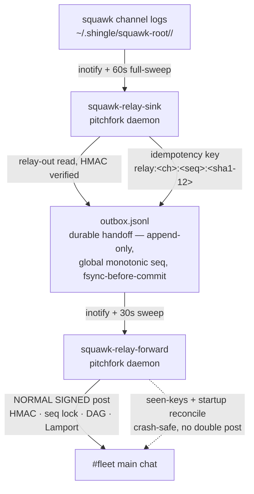

# squawk-relay — durable outbox relay 📮


> **Two daemon halves move Squawk channel traffic through a durable outbox
> into main chat (#fleet) — with at-least-once, idempotent, ordered
> delivery.** Kafka-style idempotent producer semantics + MillWheel-style
> per-record dedup, implemented file-first with zero external deps in the
> hot path.

## Features

- ✅ **At-least-once**: fsync-then-commit on the sink; commit-after-post on the forwarder — a crash replays at most one record
- 🔁 **Idempotent**: deterministic keys (`relay:<channel>:<msg_seq>:<sha1-12>`); dedup at the log (sink) AND at the consumer (forwarder seen-keys + destination reconcile). Re-injecting a key never double-posts (proven by `e2e-test.py`)
- 📶 **Ordered**: forwarder processes strictly in global outbox-seq order; failures block the queue (no skipping ahead); poison quarantined after 5 attempts
- 🔢 **Monotonic seq**: `reconcile_seq()` takes max(state, outbox) on startup and every sweep — seqs never reused, even after external appends
- 🔇 **Loop-safe**: the sink skips `skip_authors` (default: `relay`, `squawk-relay`) — relayed copies are never re-ingested. No echo loop.
- 📊 **HFT-style hop telemetry**: `relay-status` reports per-hop latency quantiles (p50/p95/max) over the last 200 forwards
- 🚫 **Fail-closed signatures**: invalid-signature records are consumed, counted, never relayed

## Architecture



## Guarantees (detail)

- **At-least-once**: fsync-then-commit on the sink; commit-after-post on the forwarder. A crash replays at most one record.
- **Idempotent**: deterministic keys; dedup at the log (sink) AND at the consumer (forwarder seen-keys + destination reconcile). Re-injecting a key never double-posts (proven by `e2e-test.py`).
- **Ordered**: forwarder processes strictly in global outbox-seq order; failures block the queue (no skipping ahead); poison quarantined after 5.
- **Monotonic seq**: `reconcile_seq()` takes max(state, outbox) on startup and every sweep — seqs are never reused, even after external appends.

## Quick Start

```bash
python3 e2e-test.py     # end-to-end proof: inject → outbox → fleet → re-inject → no dup
relay-status            # depth, lag, cursors, dup counters, hop quantiles (exit 2 = stalled)
python3 migrate.py      # one-shot: backfill keys for pre-relay outbox records
```

## Hop telemetry

`relay-status` reports per-hop latency quantiles (p50/p95/max) over the last
200 forwards, recorded in `forward-state.json: hop_samples`:

- `msg_to_outbox` — source message ts → outbox append (sink hop)
- `outbox_to_post` — outbox append → #fleet post (forward hop)

Measure every hop: if you can't see it, you can't cut it.

## Files

Live on awrawr-pc: `/home/toxic/shingle/squawk-relay/`

| file | role |
|---|---|
| `sink.py` | rig-side watcher → outbox |
| `forward.py` | shingle-side forwarder → #fleet |
| `relay_common.py` | shared: paths/env, atomic JSON, locks, key derivation, hop stats |
| `relay-status` | CLI: depth, lag, cursors, dup counters, hop quantiles (exit 2 = stalled) |
| `run-sink.sh` / `run-forward.sh` | pitchfork launchers (env-overridable paths) |
| `outbox.jsonl` | durable log (append-only) |
| `state.json` | sink cursors + feed_seq |
| `forward-state.json` | forwarder cursor, seen keys, hop samples, counters |
| `control.json` | `{paused, channels\|null, skip_authors}` — live-tuned, inotify-reloaded |
| `e2e-test.py` | end-to-end proof: inject → outbox → fleet → re-inject → no dup |
| `migrate.py` | one-shot: backfilled keys for pre-relay outbox records |
| `PAPERS.md` | research citations behind the design |

Env overrides: `SQUAWK_RELAY_DIR`, `SQUAWK_CHAT_ROOT`, `FLEET_KEYS_DIR`,
`SQUAWK_CODE_DIR`, `SQUAWK_RELAY_DIR`, `SQUAWK_RELAY_DEST`,
`SQUAWK_RELAY_IDENTITY`.

## Pitchfork

```toml
[daemons.squawk-relay-sink]     # run-sink.sh
[daemons.squawk-relay-forward]  # run-forward.sh
```

Both in `groups.all`, `retry = true`, `boot_start = true`. Existing
`squawk-feed` / `squawk-ws` daemons are untouched.

## Dev

```bash
python3 e2e-test.py          # inject → outbox → fleet → re-inject → no dup
relay-status                 # operational telemetry; exit 2 when stalled
```

## Research basis

- Transactional outbox (Richardson, microservices.io) — persist before publish, async relay, idempotent consumers.
- **arXiv:1506.08603** — Lightweight Asynchronous Snapshots for Distributed Dataflows (durable cursor/state recovery).
- **arXiv:2312.06893** — Styx: deterministic transactional streaming; exactly-once via snapshots + deterministic replay.
- MillWheel (PVLDB 2013) — per-record dedup and low-watermark ordering.
- Kafka KIP-98 / EOS — broker-side (PID, seq) dedup; producer fencing. Directly inspired the sink's log-level key dedup.
- HFT doctrine (local corpus): push-not-poll, hot paths, fail-fast ceilings, measure every hop → hop telemetry + 20s relay-out timeout.

## License & Security

Part of the sovereign estate (see repo root). **Security posture:** the
forwarder posts through the normal signed path (HMAC, sequence lock, DAG,
Lamport) as identity `relay` — relayed messages are attributable and
signature-covered. Invalid-signature records are consumed and counted, never
relayed. Relay attribution (`relayed_from` + `human`) is HMAC-covered
(canonical v3); tampering invalidates the signature.
